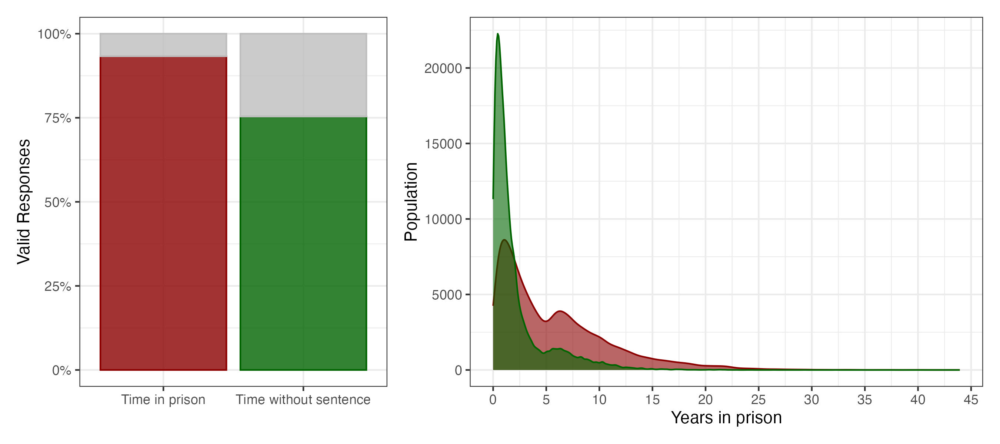

# Prison-Time

**Autor:** Marcial Yangali (marcialy\@colmex.mx)

Time shapes both individual experience and population dynamics. That's why when I saw the possibility to calculate a continuous variable of time in prisons I took it. The opportunity is linked with the availability of a national representative Mexican survey for incarcerated population (INEGI, 2026), a huge institutional effort base on social demands that we intend to exploit for understanding purposes.

This instrument captures in retrospective some key dates that allow (or at least that is what I am trying to argue here) to calculate at least two lived temporal intervals: time in prison and time without sentence (a fraction). For those sentenced, the survey also asks for the length of their sentence. However, as you can imagine, this is far more uncertain.

The applications could be many. Personally I have been done some work in order to explore spatial and demographic inequalities of pretrial detention[^readme-1] as well as tracking retrospective environmental exposure[^readme-2]. However, in order to focus on data wrangling, I proceed to explain the objective of this repository and its structure.

[^readme-1]: Yangali (2026) "Pretrial Detention 1" *Population Research and Policy Review.*

    Yangali (2026) "Pretrial Detention 2"

    Yangali (2024) "Pretrial Detention 0" Thesis

[^readme-2]: Yangali (2026) "Heat stress behind bars". (Work in progress)

We intend to calculate the two temporal intervals by three approaches. From simpler to complex, all of them use detention date as the beginning of liberty deprivation. In the fourth section, when I compare it with the reported discrete time variable, we discuss the conceptual implications of use detention as incarceration starting point. Said so, we identify and use two other points in time for and calculus the length of the interval by a simple difference: the date of interview and the date of sentence.

The complexity of the approaches relies mainly in the different treatment for non specified and granularity of dates and the possibility to measure the estimates uncertainty. We comment more details later, so without further introductions here is the structure which subtitles also happens to be the names of specific R scripts (in the "R" folder).

0 Tabular merge and item selection

1 Measure and remove NA

2 Simple random day imputation

3 Uncertainty propagation with multiple imputation

4 Validation with discrete variable

## 0 Tabular merge and item selection

ENPOL database could be downloaded from [INEGI website](https://www.inegi.org.mx/programas/enpol/2021/#microdatos). If you choose .RData format, you will have 7 data.frames with different sections of the survey, therefore we are going to select only the items needed for prison time calculus and merge them as they are not in the same data.frame. This results in `microdata` object and an additional vector named `survey_dates` with all the possible dates of interview during the lifting period.

Both were storage in a new .RData which can be read:

```{r}
load("in/data.RData")
```

## 1 Measure and remove NA

In this section we use the most basic approach. Calculate time in prison and time with a sentence only with fully available dates. As you can seen on the script, this approach also uses one single survey date "2021-07-05" (the middle of the lifting period).



5.3 Respecto al delito o delitos por los que se le acusó, y por el cuál o cuáles se encuentra en este Centro ¿el Juez….

1 NO le ha dictado sentencia por ningún delito (es decir, el juez o jueces no han decidido si lo consideran culpable)? 2 le dictó sentencia por algunos delitos y por otros aún está en espera? 3 ya dictó sentencia por (todos) el(los) delito(s) (es decir, ya lo consideraron culpable? 8 No sabe 9 No responde

\- eliminar no especificados

\- revisar no especificados por año, mes y día

## 2 Simple random day imputation

\- imputar aleatoriamente mes/día no especificados

\- mantener año no especificado como NA

## 3 Uncertainty propagation with multiple imputation

Idea:

Generar m bases imputadas.

En cada base:

\* mes/día de detención no especificados se imputan aleatoriamente.

\* día de sentencia se imputa aleatoriamente dentro del mes.

\* mes de sentencia no especificado se imputa aleatoriamente.

\* fecha de entrevista se asigna aleatoriamente dentro del levantamiento.

```{r}

```
