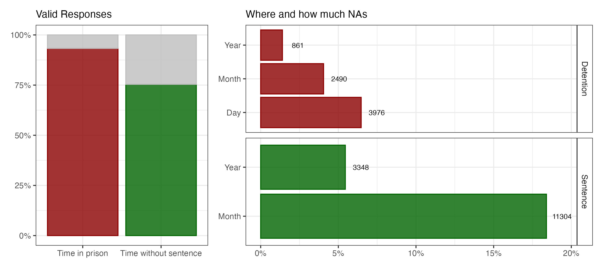

# Prison-Time

**Author:** Marcial Yangali (marcialy\@colmex.mx)

## Introduction

Time shapes both individual experience and population dynamics. It is therefore one of the central dimensions of prison research. At the individual level, it determines the probability that a person is observed in prison. From a demographic perspective, it also defines the exposure window over which incarceration-related experiences accumulate. Collectively, these individual exposure intervals also provide a volume perspective, expressed in person-years, that can be used to study prison population dynamics and quantify cumulative stressors such as overcrowding.

Despite its importance, continuous measures of prison time are rarely available in prison population datasets, and when they are, their temporal resolution is often limited. An exception is the Mexican National Survey of Incarcerated Population (ENPOL 2021), which offers a unique opportunity to reconstruct individual prison trajectories. Besides collecting information on legal status and prison conditions, the survey records several retrospective dates that make it possible to estimate continuous temporal intervals. In this repository, we focus on two of them:

- Time in prison, measured from detention to the interview date.
- Time without sentencing, measured from detention to sentencing (or to the interview date for individuals who had not yet been sentenced).

These variables have multiple applications. In my own work they have been used to study demographic and spatial inequalities in pretrial detention[^readme-1] and to reconstruct retrospective environmental exposure histories inside prisons[^readme-2]. More generally, however, the purpose of this repository is methodological: to document how these temporal variables are constructed, validated, and prepared for subsequent analyses.

[^readme-1]: **Yangali, Marcial** & García-Guerrero, V. M. (2026). Years of life lost in prison without sentencing: Analysis of legal and sociodemographic factors in Mexico. Population Research and Policy Review, 45, Article 36. <https://doi.org/10.1007/s11113-026-10021-7>

    Yangali (2026) "Pretrial Detention 2"

    Yangali (2024) "Pretrial Detention 0" Thesis

[^readme-2]: Yangali (2026) "Heat stress behind bars". (Work in progress)

For sentenced individuals, the survey also records the reported length of the prison sentence imposed by the judge. Although this measure is potentially useful for estimating future incarceration time, it is substantially more uncertain than the reconstructed temporal intervals because the effective duration of imprisonment may subsequently change through sentence reductions, new convictions, or other legal mechanisms.

## Approach

Three alternative reconstruction strategies are presented, ranging from a conservative complete-case approach to random and multiple imputation procedures for partially missing dates.

All approaches use the detention date as the beginning of liberty deprivation. Although detention may precede physical admission to prison by a short period, it provides the closest date reference available in ENPOL. Section 4 evaluates this assumption by comparing the reconstructed intervals with the survey’s reported discrete measures of time in prison.

The differences among the approaches lie primarily in how incomplete dates are handled and in whether uncertainty introduced by imputation is explicitly propagated through the estimates.

The repository is organized into the following scripts:

> 0.  Tabular merge and item selection
> 1.  Complete-case estimation
> 2.  Simple random date imputation
> 3.  Multiple imputation and uncertainty propagation
> 4.  Validation against discrete measures

Complete implementations are available in the R folder. This README summarizes the main workflow and highlights the key results of each approach.

## 0 Tabular merge and item selection

ENPOL database could be downloaded from [INEGI website](https://www.inegi.org.mx/programas/enpol/2021/#microdatos). When imported in .RData format, the survey is distributed across several data frames corresponding to different questionnaire sections. Because the variables required to reconstruct prison time are scattered throughout these files, the first step is to select the relevant items and merge them into a single analytical dataset.

The resulting object, `microdata`, contains the variables required for temporal reconstruction, including detention date, sentencing date, legal status, survey weights, and the survey’s discrete measure of time in prison, which will later be used for validation.

This script also creates the object `survey_dates`, a vector containing every possible interview date during the ENPOL fieldwork period (June 14 to July 26, 2021). It is used in later scripts to randomly assign interview dates during the imputation procedures.

Both objects are saved in a single .RData file that can be loaded as follows:

```         
load("in/data.RData")
```

## 1 Complete-case estimation

This section implements the most conservative reconstruction strategy. Temporal intervals are calculated only for individuals with fully specified date components. Detention dates require year, month, and day; sentencing dates require year and month, since ENPOL does not record the exact day of sentencing. When the sentencing year and month are available, the day is fixed at the 15th of the month.

The sentencing status variable is used to distinguish between sentenced and unsentenced individuals. For respondents who had not yet received a sentence at the time of the interview, time without sentencing is set equal to the total time in prison. Otherwise, it is calculated as the interval between detention and the reported sentencing date.

For this first approach, the interview date is fixed at the last day of the fieldwork period, July 26, 2021. This avoids negative durations for individuals whose detention date falls after an earlier assumed interview date. Later approaches replace this fixed date with random assignment within the fieldwork period.

This complete-case strategy is useful as a baseline because it avoids imputation. However, it also produces missing values when any required date component is not specified. As shown below, valid responses are higher for time in prison than for time without sentencing, because the latter requires information from both the detention and sentencing dates.



> Under this approach, 93.3% of individuals have enough information to estimate time in prison, while 75.4% have enough information to estimate time without sentencing. The average estimated time in prison is 5.78 years, compared with 2.20 years without sentencing. The distributions show that both intervals are concentrated in the first years of incarceration, although time without sentencing is more strongly concentrated between 0 and 3 years.

## 2 Simple random day imputation

\- imputar aleatoriamente mes/día no especificados

\- mantener año no especificado como NA

## 3 Uncertainty propagation with multiple imputation

Idea:

Generar m bases imputadas.

En cada base:

\* mes/día de detención no especificados se imputan aleatoriamente.

\* día de sentencia se imputa aleatoriamente dentro del mes.

\* mes de sentencia no especificado se imputa aleatoriamente.

\* fecha de entrevista se asigna aleatoriamente dentro del levantamiento.

```{r}

```

## 4 Validation against discrete measures

Use discrete variable

1.1a ¿Cuánto tiempo tiene privado de su libertad? (Desde su ingreso a un centro penitenciario hasta el momento de la entrevista)
